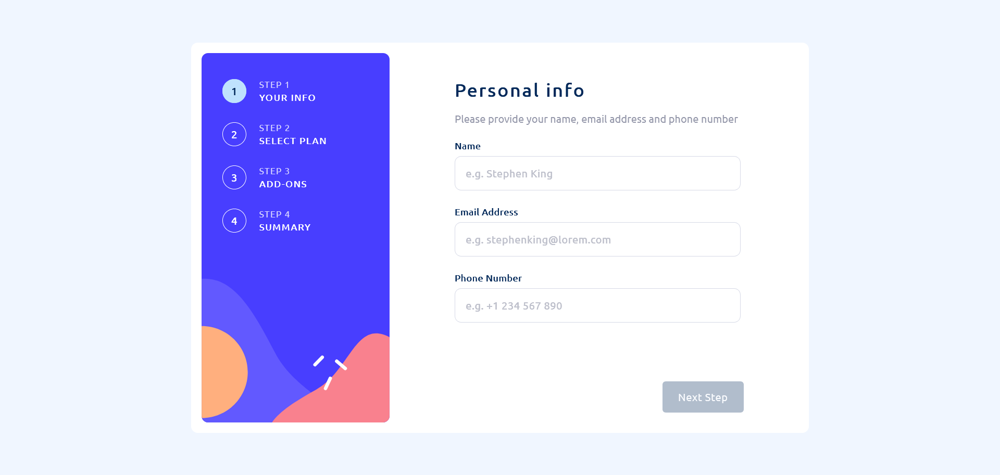

# Frontend Mentor - Multi-step form

# Frontend Mentor - Multi-step form solution

This is a solution to the [Multi-step form challenge on Frontend Mentor](https://www.frontendmentor.io/challenges/multistep-form-YVAnSdqQBJ). Frontend Mentor challenges help you improve your coding skills by building realistic projects. 

## Table of contents

- [Overview](#overview)
  - [The challenge](#the-challenge)
  - [Screenshot](#screenshot)
  - [Links](#links)
- [My process](#my-process)
  - [Built with](#built-with)
  - [What I learned](#what-i-learned)
- [Author](#author)

## Overview

### The challenge

Users should be able to:

- Complete each step of the sequence
- Go back to a previous step to update their selections
- See a summary of their selections on the final step and confirm their order
- View the optimal layout for the interface depending on their device's screen size
- See hover and focus states for all interactive elements on the page
- Receive form validation messages if:
  - A field has been missed
  - The email address is not formatted correctly
  - A step is submitted, but no selection has been made

### Screenshot

### Links

- Solution URL: [Solution on Frontend Mentor Website](https://www.frontendmentor.io/solutions/multistep-form-built-w-angular-DjOHT9vM-M)
- Live Site URL: [Link](https://multistep-form-gules.vercel.app/)

## My process

### Built with

- Angular
- SCSS
- Typescript
- BEM Notation
- Template Driven Forms approach
- Validations using Angular Directives
- Mobile first workflow approach

### What I learned

I learned how to build forms using the Template Driven Forms approach.

## Author

- Contact - [LinkedIn](https://www.linkedin.com/in/danielmrz-dev/)
- Frontend Mentor profile - [@danielmrz-dev](https://www.frontendmentor.io/profile/danielmrz-dev)